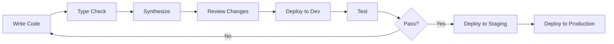

# Development Workflow

## Table of Contents
- [Overview](#overview)
- [Development Setup](#development-setup)
- [CDK8s Development Patterns](#cdk8s-development-patterns)
- [Adding New Applications](#adding-new-applications)
- [Multi-Environment Deployments](#multi-environment-deployments)
- [Testing and Validation](#testing-and-validation)
- [Deployment Process](#deployment-process)
- [CI/CD Integration](#cicd-integration)
- [Best Practices](#best-practices)
 - [IdpBuilder Packages](#idpbuilder-packages)

## Overview

This guide covers the development workflow for our CDK8s-based GitOps infrastructure, including patterns for creating new applications, testing changes, and deploying to multiple environments.

## Development Setup

### Prerequisites

```bash
# Required tools
node --version  # 18+
npm --version   # 9+
kubectl version
kind version
idpbuilder version

# Install CDK8s CLI
npm install -g cdk8s-cli

# Install project dependencies
cd /home/vpittamp/stacks/cdk8s
npm install
```

### Project Structure

```
cdk8s/
├── charts/                 # Chart definitions
│   ├── apps/              # Application-specific charts
│   └── *.ts               # Infrastructure charts
├── config/
│   └── applications.ts    # Application configurations
├── lib/                   # Shared libraries
│   ├── idpbuilder-chart-factory.ts
│   └── idpbuilder-types.ts
├── scripts/               # Build and utility scripts
├── dist/                  # Generated manifests
└── main-v2.ts            # Main entry point
```

## CDK8s Development Patterns

### 1. Chart Factory Pattern

All charts are created through a factory for consistency:

```typescript
// lib/idpbuilder-chart-factory.ts
export class IdpBuilderChartFactory {
  static register(name: string, constructor: ChartConstructor): void {
    this.chartConstructors.set(name, constructor);
  }
  
  static async createChart(app: App, config: ApplicationConfig): Promise<Chart> {
    const ChartClass = this.chartConstructors.get(config.chart.type);
    return new ChartClass(app, 'install', config.chart.props);
  }
}
```

### 2. Parameterized Charts

Create reusable charts for multiple environments:

```typescript
// charts/apps/my-app-parameterized-chart.ts
export interface MyAppParameterizedChartProps extends ChartProps {
  environmentName: string;
  replicas?: number;
  resources?: ResourceRequirements;
}

export class MyAppParameterizedChart extends Chart {
  constructor(scope: Construct, id: string, props: MyAppParameterizedChartProps) {
    super(scope, id, props);
    
    const envName = props.environmentName;
    const replicas = props.replicas || (envName === 'production' ? 3 : 1);
    
    // Environment-specific configuration
    const resources = props.resources || {
      limits: {
        cpu: envName === 'production' ? '2' : '500m',
        memory: envName === 'production' ? '4Gi' : '1Gi'
      },
      requests: {
        cpu: envName === 'production' ? '1' : '100m',
        memory: envName === 'production' ? '2Gi' : '256Mi'
      }
    };
    
    new k8s.KubeDeployment(this, `${envName}-deployment`, {
      metadata: {
        name: `my-app-${envName}`,
        namespace: 'my-app'
      },
      spec: {
        replicas,
        template: {
          spec: {
            containers: [{
              resources,
              // ... other config
            }]
          }
        }
      }
    });
  }
}
```

### 3. Application Charts

Create ArgoCD Application definitions:

```typescript
// charts/apps/my-app-dev-application-chart.ts
export class MyAppDevApplicationChart extends Chart {
  constructor(scope: Construct, id: string, props?: ChartProps) {
    super(scope, id, props);
    
    new Application(this, 'my-app-dev', {
      metadata: {
        name: 'my-app-dev',
        namespace: 'argocd',
        annotations: {
          'argocd.argoproj.io/sync-wave': '100'
        }
      },
      spec: {
        project: 'default',
        destination: {
          name: 'dev-vcluster',
          namespace: 'my-app'
        },
        source: {
          repoUrl: 'cnoe://my-app-dev/manifests',
          targetRevision: 'HEAD',
          path: '.'
        },
        syncPolicy: {
          automated: {
            prune: true,
            selfHeal: true
          },
          syncOptions: ['CreateNamespace=true']
        }
      }
    });
  }
}
```

## Adding New Applications

### Step 1: Create the Chart

```typescript
// charts/my-new-app-chart.ts
import { Chart, ChartProps } from 'cdk8s';
import { Construct } from 'constructs';
import * as k8s from '../imports/k8s';

export class MyNewAppChart extends Chart {
  constructor(scope: Construct, id: string, props?: ChartProps) {
    super(scope, id, props);
    
    // Define your Kubernetes resources
    new k8s.KubeNamespace(this, 'namespace', {
      metadata: { name: 'my-new-app' }
    });
    
    new k8s.KubeDeployment(this, 'deployment', {
      // ... deployment spec
    });
    
    new k8s.KubeService(this, 'service', {
      // ... service spec
    });
  }
}
```

### Step 2: Register the Chart

```typescript
// main-v2.ts
import { MyNewAppChart } from './charts/my-new-app-chart';

// Register with factory
IdpBuilderChartFactory.register('MyNewAppChart', MyNewAppChart);
```

### Step 3: Add to Configuration

```typescript
// config/applications.ts
export const applicationConfigs: ApplicationConfig[] = [
  // ... existing apps
  {
    name: 'my-new-app',
    namespace: 'my-new-app',
    chart: {
      type: 'MyNewAppChart',
      props: {
        // Chart-specific properties
      }
    },
    argocd: {
      syncWave: '100',
      labels: {
        'app.kubernetes.io/name': 'my-new-app',
        'app.kubernetes.io/component': 'application'
      },
      syncPolicy: {
        automated: {
          prune: true,
          selfHeal: true
        }
      }
    }
  }
];
```

### Step 4: Synthesize and Deploy

```bash
# Generate manifests
npm run synth

# Deploy with IdpBuilder
idpbuilder create --package dist/my-new-app
```

## Multi-Environment Deployments

### Pattern 1: Separate Applications

Create distinct applications per environment:

```typescript
// Generate manifests for each environment
['dev', 'staging', 'production'].forEach(env => {
  // Create parameterized chart
  new MyAppParameterizedChart(app, `my-app-${env}`, {
    environmentName: env
  });
  
  // Create ArgoCD Application
  new MyAppApplicationChart(app, `my-app-${env}-app`, {
    environment: env,
    destination: `${env}-vcluster`
  });
});
```

### Pattern 2: Shared Configuration with Overrides

```typescript
// config/applications.ts
const baseConfig = {
  chart: { type: 'MyAppChart' },
  argocd: {
    syncPolicy: {
      automated: { prune: true, selfHeal: true }
    }
  }
};

// Environment-specific overrides
export const applicationConfigs = [
  {
    ...baseConfig,
    name: 'my-app-dev',
    chart: {
      ...baseConfig.chart,
      props: { environment: 'dev', replicas: 1 }
    }
  },
  {
    ...baseConfig,
    name: 'my-app-staging',
    chart: {
      ...baseConfig.chart,
      props: { environment: 'staging', replicas: 2 }
    }
  }
];
```

### Pattern 3: Environment-Specific Images

```typescript
// Load from configuration file
import * as images from '../../.env-files/images.json';

const imageRef = images[envName as keyof typeof images]?.myApp || 'default:latest';

new k8s.KubeDeployment(this, 'deployment', {
  spec: {
    template: {
      spec: {
        containers: [{
          image: imageRef
        }]
      }
    }
  }
});
```

## Testing and Validation

### Type Checking

```bash
# Run TypeScript type checker
npm run type-check

# Output
✓ No type errors found
```

### Synthesis Validation

```bash
# Validate synthesis without writing files
npm run validate

# Full synthesis with validation
npm run synth
```

### Dry Run

```bash
# Generate and review changes without applying
npm run synth
kubectl diff -f dist/my-app/manifests/
```

### Local Testing with Kind

```bash
# Create local cluster
kind create cluster --name test

# Apply manifests directly (for testing)
kubectl apply -f dist/my-app/manifests/

# Verify deployment
kubectl get all -n my-app
```

## Deployment Process

### Development Workflow



### Synthesis Options

```bash
# Fast synthesis (uses esbuild)
npm run synth:fast

# Selective synthesis (specific charts)
npm run synth:selective -- --charts my-app,other-app

# Watch mode for development
npm run watch:smart

# Full synthesis with dependency analysis
npm run synth
```

### Deployment Commands

```bash
# Deploy all applications
idpbuilder create --package dist/

# Deploy specific application
idpbuilder create --package dist/my-app

# Deploy multiple applications
for app in my-app other-app; do
  idpbuilder create --package dist/$app
done

## IdpBuilder Packages

- Our synth step creates IdpBuilder-compatible packages under `cdk8s/dist/` with:
  - `dist/<app>/manifests/` (Kubernetes YAML + kustomization.yaml)
  - `dist/<app>.yaml` (ArgoCD Application referencing `cnoe://<app>/manifests` for local dev)
- To deploy all packages:
  - `idpbuilder create --package cdk8s/dist/`
- To deploy a single package:
  - `idpbuilder create --package cdk8s/dist/<app>`
- See also: [CDK8s Architecture, Code Organization, and IdpBuilder Packaging](./cdk8s-architecture-and-packaging.md)
```

### Rollback Procedure

```bash
# Via ArgoCD
argocd app rollback my-app <revision>

# Via kubectl
kubectl rollout undo deployment/my-app -n my-namespace

# Complete reset
kubectl delete application my-app -n argocd
idpbuilder create --package dist/my-app
```

## CI/CD Integration

### GitHub Actions Example

```yaml
# .github/workflows/deploy.yml
name: Deploy CDK8s Applications

on:
  push:
    branches: [main]
    paths:
      - 'cdk8s/**'
      - '.env-files/**'

jobs:
  deploy:
    runs-on: ubuntu-latest
    steps:
      - uses: actions/checkout@v3
      
      - name: Setup Node.js
        uses: actions/setup-node@v3
        with:
          node-version: '18'
          
      - name: Install dependencies
        run: |
          cd cdk8s
          npm ci
          
      - name: Type check
        run: npm run type-check
        
      - name: Synthesize
        run: npm run synth:fast
        
      - name: Deploy to Dev
        if: github.ref == 'refs/heads/develop'
        run: |
          idpbuilder create --package dist/ --env dev
          
      - name: Deploy to Production
        if: github.ref == 'refs/heads/main'
        run: |
          idpbuilder create --package dist/ --env production
```

### Pre-commit Hooks

```bash
# .husky/pre-commit
#!/bin/sh
cd cdk8s
npm run type-check
npm run validate
```

## Best Practices

### 1. Resource Organization

- Group related resources in the same chart
- Use consistent naming: `<app>-<env>-<resource>`
- Apply appropriate labels for filtering

### 2. Configuration Management

```typescript
// Use interfaces for type safety
interface AppConfig {
  name: string;
  environment: 'dev' | 'staging' | 'production';
  replicas: number;
  resources: k8s.ResourceRequirements;
}

// Validate configuration
function validateConfig(config: AppConfig): void {
  if (config.replicas < 1) {
    throw new Error('Replicas must be at least 1');
  }
  // Additional validation
}
```

### 3. Dependency Management

```typescript
// Declare dependencies explicitly
dependencies: {
  database: 'postgres',
  cache: 'redis',
  secrets: 'app-secrets'
}

// Use sync waves for ordering
annotations: {
  'argocd.argoproj.io/sync-wave': '100'  // After dependencies
}
```

### 4. Error Handling

```typescript
// Graceful degradation
const image = images[env]?.app || 'default-image:latest';

// Validation
if (!config.namespace) {
  throw new Error(`Namespace required for ${config.name}`);
}
```

### 5. Documentation

```typescript
/**
 * Creates a parameterized application chart
 * @param scope - CDK8s construct scope
 * @param id - Unique identifier
 * @param props - Configuration properties
 * @example
 * new MyAppChart(app, 'my-app', {
 *   environment: 'dev',
 *   replicas: 2
 * });
 */
export class MyAppChart extends Chart {
  // Implementation
}
```

### 6. Security

- Never hardcode secrets
- Use External Secrets for sensitive data
- Apply SecurityContext to pods
- Set resource limits to prevent DoS
- Use NetworkPolicies for isolation

### 7. Performance

- Use `npm run synth:fast` for development
- Leverage parallel synthesis for independent charts
- Cache dependencies where possible
- Optimize Docker images for size

## Troubleshooting Development Issues

### TypeScript Errors

```bash
# Clear TypeScript cache
rm -rf node_modules/.cache
npm run type-check
```

### Synthesis Failures

```bash
# Clean and rebuild
rm -rf dist/
npm run clean
npm run synth
```

### Import Issues

```bash
# Regenerate imports
npm run import
```

## Related Documentation

- [GitOps Architecture Overview](./gitops-architecture-overview.md)
- [VCluster Architecture](./vcluster-architecture.md)
- [Secrets Management](./secrets-management.md)
- [Troubleshooting Guide](./troubleshooting-guide.md)
