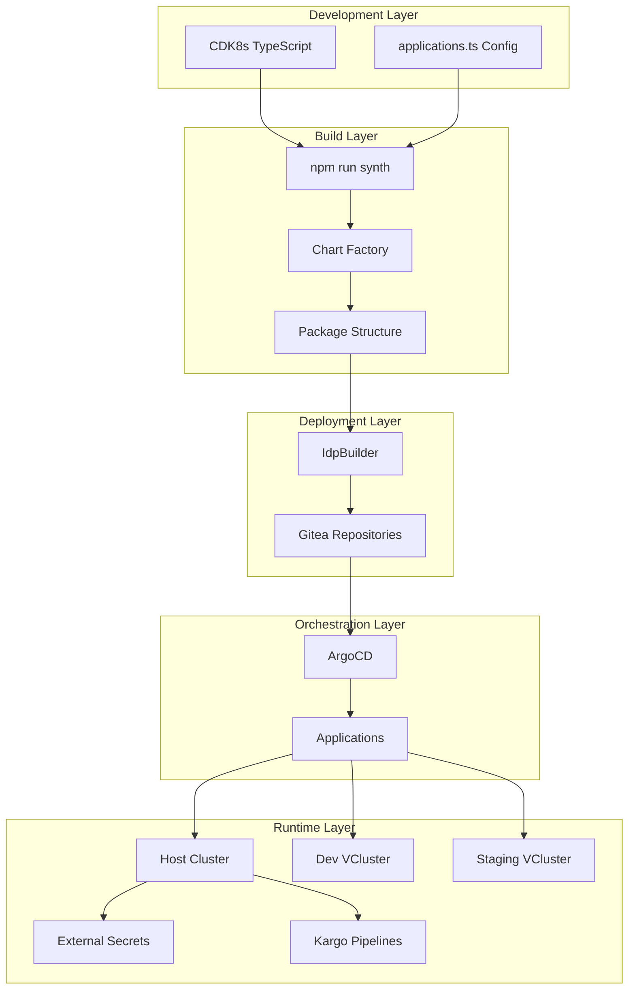

# GitOps Architecture Overview

## Table of Contents
- [Introduction](#introduction)
- [Architecture Overview](#architecture-overview)
- [Core Design Decisions](#core-design-decisions)
- [CDK8s Configuration](#cdk8s-configuration)
- [IdpBuilder Integration](#idpbuilder-integration)
- [Gitea Repository Management](#gitea-repository-management)
- [Package Structure](#package-structure)

## Introduction

This document provides a comprehensive overview of our GitOps infrastructure built on CDK8s, ArgoCD, and IdpBuilder. Our setup emphasizes type-safe infrastructure as code, automated deployments, and multi-environment isolation through VClusters.

## Architecture Overview



## Core Design Decisions

### 1. Applications vs ApplicationSets

We made a deliberate choice to use individual ArgoCD `Applications` instead of `ApplicationSets` for most deployments. This decision was driven by several factors:

**Why Applications:**
- **Explicit Control**: Each application has its own lifecycle and configuration
- **TypeScript Type Safety**: Direct Application objects provide better TypeScript intellisense
- **Debugging**: Easier to trace issues with individual applications
- **Gradual Rollout**: Can deploy/update applications independently
- **IdpBuilder Compatibility**: Works seamlessly with IdpBuilder's package model

**Implementation:**
```typescript
// Example from backstage-dev-application-chart.ts
new Application(this, 'backstage-dev', {
  metadata: {
    name: 'backstage-dev',
    namespace: 'argocd',
    annotations: {
      'argocd.argoproj.io/sync-wave': '20',
      'kargo.akuity.io/authorized-stage': 'kargo-pipelines:backstage-dev'
    }
  },
  spec: {
    project: 'default',
    destination: {
      name: 'dev-vcluster',
      namespace: 'backstage'
    },
    source: {
      repoUrl: 'cnoe://backstage-dev/manifests',
      targetRevision: 'HEAD',
      path: '.'
    }
  }
});
```

### 2. Solving YAML Templating Issues with TypeScript

Traditional YAML templating (Helm, Kustomize) presents several challenges:
- String interpolation errors
- No compile-time validation
- Limited logic capabilities
- Difficult to test
- Poor IDE support

**Our Solution: CDK8s with TypeScript**

Benefits:
- **Type Safety**: Compile-time validation of Kubernetes resources
- **IDE Support**: Full autocomplete, refactoring, and error detection
- **Reusability**: Shared functions and classes
- **Testing**: Unit tests for infrastructure code
- **Complex Logic**: Full programming language capabilities

Example of parameterized chart solving templating issues:
```typescript
// backstage-parameterized-chart.ts
export class BackstageParameterizedChart extends Chart {
  constructor(scope: Construct, id: string, props: BackstageParameterizedChartProps) {
    super(scope, id, props);
    
    const envName = props.environmentName;
    const imageRef = images[envName as keyof typeof images]?.backstage;
    
    // Type-safe environment-specific configuration
    const resources = envName === 'dev' 
      ? { cpu: '100m', memory: '256Mi' }
      : { cpu: '500m', memory: '1Gi' };
    
    // Conditional health checks (solved dev environment issues)
    const healthProbes = envName !== 'dev' ? {
      livenessProbe: {
        httpGet: {
          path: '/healthcheck',
          port: k8s.IntOrString.fromNumber(7007)
        }
      }
    } : {};
  }
}
```

## CDK8s Configuration

### Chart Factory Pattern

We use a factory pattern to dynamically create charts based on configuration:

```typescript
// lib/idpbuilder-chart-factory.ts
export class IdpBuilderChartFactory {
  private static chartConstructors = new Map<string, ChartConstructor>();
  
  static register(name: string, constructor: ChartConstructor): void {
    this.chartConstructors.set(name, constructor);
  }
  
  static async createChart(app: App, config: ApplicationConfig): Promise<Chart> {
    const ChartClass = this.chartConstructors.get(config.chart.type);
    return new ChartClass(app, 'install', config.chart.props);
  }
}
```

### Application Configuration

All applications are defined in a centralized configuration file:

```typescript
// config/applications.ts
export const applicationConfigs: ApplicationConfig[] = [
  {
    name: 'backstage-dev',
    namespace: 'backstage',
    chart: {
      type: 'BackstageParameterizedChart',
      props: { environmentName: 'dev' }
    },
    argocd: {
      syncWave: '100',
      destination: 'dev-vcluster',
      syncPolicy: {
        automated: { prune: true, selfHeal: true }
      }
    }
  },
  // ... more applications
];
```

### Synthesis Process

The synthesis process transforms TypeScript definitions into Kubernetes manifests:

1. **Read Configuration**: Load application configs from `applications.ts`
2. **Factory Creation**: Use factory to instantiate chart classes
3. **Generate Manifests**: CDK8s synthesizes to YAML
4. **Package Structure**: Organize into IdpBuilder-compatible structure

```bash
# Fast synthesis with esbuild optimization
npm run synth:fast

# Output structure
dist/
├── backstage-dev.yaml          # ArgoCD Application
├── backstage-dev/
│   └── manifests/
│       ├── Deployment.backstage-dev.k8s.yaml
│       ├── Service.backstage-dev.k8s.yaml
│       └── ...
```

## IdpBuilder Integration

IdpBuilder expects a specific package structure that we generate automatically:

### Package Structure Requirements

```
package-name/
├── manifests/           # Kubernetes resources
│   └── *.yaml
└── values.yaml          # Optional Helm values
```

### How We Create IdpBuilder Packages

1. **Chart Synthesis**: CDK8s generates individual YAML files
2. **Directory Structure**: Organized into `dist/<package>/manifests/`
3. **Application Manifest**: Top-level ArgoCD Application at `dist/<package>.yaml`
4. **Kustomization**: Each package includes `kustomization.yaml` for resource ordering

### Deployment with IdpBuilder

```bash
# Deploy all packages
idpbuilder create --package dist/

# Deploy specific package
idpbuilder create --package dist/backstage-dev
```

IdpBuilder handles:
- Creating Gitea repositories
- Pushing manifests to Git
- Rewriting `cnoe://` URLs to actual Gitea URLs
- Triggering ArgoCD sync

## Gitea Repository Management

### CNOE:// URL Syntax

The `cnoe://` protocol is a special syntax understood by IdpBuilder:

```yaml
source:
  repoUrl: cnoe://backstage-dev/manifests
  path: .
  targetRevision: HEAD
```

**How it works:**

1. **Relative Path**: `cnoe://` indicates a local package path
2. **IdpBuilder Processing**: 
   - Creates repository: `https://gitea.cnoe.localtest.me:8443/giteaAdmin/idpbuilder-localdev-backstage-dev-manifests.git`
   - Pushes `dist/backstage-dev/manifests/` contents
   - Rewrites Application source URL to Gitea URL
3. **ArgoCD Sync**: ArgoCD pulls from the created Gitea repository

### Repository Naming Convention

IdpBuilder creates repositories with the pattern:
```
idpbuilder-localdev-<package-name>-manifests
```

This ensures:
- Unique repository names
- Clear package identification
- Consistent organization in Gitea

## Package Structure

### Standard Package Layout

Each package follows this structure:

```
package-name/
├── manifests/
│   ├── kustomization.yaml      # Resource ordering
│   ├── Namespace.*.yaml        # Sync wave: -100
│   ├── ServiceAccount.*.yaml   # Sync wave: -90
│   ├── Secret.*.yaml           # Sync wave: -80
│   ├── ConfigMap.*.yaml        # Sync wave: -70
│   ├── Deployment.*.yaml       # Sync wave: 0
│   ├── Service.*.yaml          # Sync wave: 10
│   └── Ingress.*.yaml          # Sync wave: 20
```

### Multi-Environment Packages

For applications deployed to multiple environments:

```typescript
// Generate environment-specific manifests
['dev', 'staging'].forEach(env => {
  const chart = new BackstageParameterizedChart(app, `backstage-${env}`, {
    environmentName: env
  });
  
  // Output to dist/backstage-${env}/manifests/
});

// Create separate ArgoCD Applications
new BackstageDevApplicationChart(app, 'backstage-dev');
new BackstageStagingApplicationChart(app, 'backstage-staging');
```

### Dependency Management

Charts can depend on other resources:

```typescript
// config/applications.ts
{
  name: 'backstage-dev',
  dependencies: {
    secrets: 'backstage-secrets',  // Must be deployed first
    database: 'postgres'
  },
  chart: { type: 'BackstageParameterizedChart' }
}
```

The factory resolves dependencies and ensures proper ordering through ArgoCD sync waves.

## Best Practices

1. **Use TypeScript Types**: Define interfaces for all chart props
2. **Parameterize for Environments**: Use parameterized charts for multi-env deployments
3. **Sync Waves**: Use annotations to control deployment order
4. **Resource Limits**: Always set resource requests/limits
5. **Health Checks**: Configure appropriate for each environment
6. **Image Pull Secrets**: Configure GHCR authentication for private images
7. **Labels and Annotations**: Use consistent labeling for resource management

## Troubleshooting

Common issues and solutions:

1. **CNOE URL Not Resolving**: Ensure IdpBuilder is used for deployment
2. **Sync Out of Order**: Check ArgoCD sync-wave annotations
3. **Type Errors**: Run `npm run type-check` before synthesis
4. **Missing Dependencies**: Verify chart registration in `main-v2.ts`

## Related Documentation

- [VCluster Architecture](./vcluster-architecture.md)
- [Secrets Management](./secrets-management.md)
- [Development Workflow](./development-workflow.md)
- [Troubleshooting Guide](./troubleshooting-guide.md)