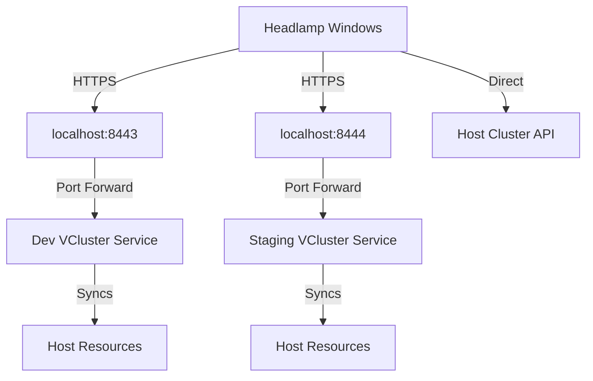

# Headlamp Integration Guide for WSL2 Kubernetes Clusters

## Table of Contents
- [Overview](#overview)
- [Architecture](#architecture)
- [Prerequisites](#prerequisites)
- [Installation](#installation)
- [Configuration](#configuration)
- [Usage](#usage)
- [Troubleshooting](#troubleshooting)
- [Technical Details](#technical-details)
- [Best Practices](#best-practices)

## Overview

This guide documents how to integrate Headlamp for Windows Desktop with Kubernetes clusters running in WSL2, including both the host cluster and vclusters. The solution uses optimized vcluster CLI features and handles the unique networking challenges of WSL2/Docker Desktop environments.

### Key Features
- **Multi-cluster Support**: Access host cluster and all vclusters from a single Headlamp instance
- **Optimized Connectivity**: Uses vcluster CLI's native features for efficient connection management
- **Windows Integration**: Seamless access from Windows Desktop to WSL2 clusters
- **Automated Setup**: Scripts handle kubeconfig generation and port-forwarding

## Architecture

### Component Stack
```
┌─────────────────────────────────────┐
│     Windows Desktop                  │
│     └── Headlamp Application         │
│         └── Kubeconfig               │
│             ├── Host Cluster         │
│             ├── Dev VCluster         │
│             └── Staging VCluster     │
├─────────────────────────────────────┤
│     WSL2 Linux                       │
│     └── Port Forwards                │
│         ├── localhost:8443 → dev     │
│         └── localhost:8444 → staging │
├─────────────────────────────────────┤
│     Docker Desktop                   │
│     └── Kind Cluster                 │
│         ├── Host Resources           │
│         ├── Dev VCluster Pod         │
│         └── Staging VCluster Pod     │
└─────────────────────────────────────┘
```

### Network Flow


## Prerequisites

### Required Software
1. **Windows Side**:
   - Headlamp Desktop Application ([Download](https://headlamp.dev/))
   - PowerShell 5.0 or higher
   - WSL2 enabled and configured

2. **WSL2 Side**:
   - kubectl CLI installed
   - vcluster CLI installed
   - Docker Desktop with Kubernetes enabled
   - Running Kubernetes cluster with vclusters

### Installation Commands

#### Install vcluster CLI (WSL2)
```bash
curl -L -o vcluster 'https://github.com/loft-sh/vcluster/releases/latest/download/vcluster-linux-amd64'
chmod +x vcluster
sudo mv vcluster /usr/local/bin
```

#### Install Headlamp (Windows)
Download and install from: https://headlamp.dev/

## Configuration

### Step 1: Run Setup Script (WSL2)

The setup script automatically:
- Detects all running vclusters
- Generates optimized kubeconfig entries
- Copies configuration to Windows
- Creates port-forward management scripts

```bash
# Run the setup script
/home/vpittamp/stacks/scripts/setup-headlamp-access.sh

# Or with custom settings
PORT_START=9000 ./setup-headlamp-access.sh
```

### Step 2: Start Port Forwards (WSL2)

Port-forwarding is required for vcluster access:

```bash
# Start all port-forwards automatically
~/.kube/headlamp/start-port-forwards.sh

# Or manually for specific clusters
kubectl port-forward -n dev-vcluster svc/vcluster-dev-helm 8443:443 &
kubectl port-forward -n staging-vcluster svc/vcluster-staging-helm 8444:443 &
```

### Step 3: Configure Headlamp (Windows)

Run the PowerShell helper script to configure environment:

```powershell
# Open PowerShell as Administrator (if needed)
# Navigate to your user directory
cd $env:USERPROFILE\.kube

# Run the setup script
.\headlamp-setup.ps1
```

This script:
- Sets KUBECONFIG environment variable
- Validates kubeconfig exists
- Launches Headlamp if installed

### Step 4: Verify in Headlamp

1. Open Headlamp Desktop
2. Check that all clusters appear:
   - `kind-localdev` (host cluster)
   - `dev-vcluster` 
   - `staging-vcluster`
3. Click on each cluster to verify connectivity

## Usage

### Daily Workflow

1. **Start WSL2 Terminal**:
   ```bash
   # Start port-forwards (keep terminal open or use tmux/screen)
   ~/.kube/headlamp/start-port-forwards.sh
   ```

2. **Open Headlamp on Windows**:
   - Launch from Start Menu or Desktop shortcut
   - All clusters should be accessible

3. **Switch Between Clusters**:
   - Use Headlamp's cluster dropdown
   - Each cluster shows its own resources
   - VClusters show synced resources from host

### Using tmux for Persistent Port-Forwards

```bash
# Create a tmux session for port-forwards
tmux new-session -d -s headlamp-ports '~/.kube/headlamp/start-port-forwards.sh'

# Attach to see output
tmux attach -t headlamp-ports

# Detach with Ctrl+B, then D
# Session continues running in background
```

### Automation with systemd (WSL2)

Create a systemd user service (if systemd is enabled in WSL2):

```bash
# Create service file
cat > ~/.config/systemd/user/headlamp-ports.service <<EOF
[Unit]
Description=Headlamp Port Forwards
After=network.target

[Service]
Type=simple
ExecStart=/home/vpittamp/.kube/headlamp/start-port-forwards.sh
Restart=always
RestartSec=10

[Install]
WantedBy=default.target
EOF

# Enable and start
systemctl --user enable headlamp-ports.service
systemctl --user start headlamp-ports.service
```

## Troubleshooting

### Common Issues

#### 1. Clusters Not Appearing in Headlamp

**Symptom**: Headlamp doesn't show all clusters

**Solutions**:
- Verify KUBECONFIG environment variable:
  ```powershell
  echo $env:KUBECONFIG
  ```
- Check kubeconfig file exists:
  ```powershell
  Test-Path "$env:USERPROFILE\.kube\headlamp-config"
  ```
- Restart Headlamp after setting KUBECONFIG

#### 2. VCluster Connection Failed

**Symptom**: Can't connect to dev or staging clusters

**Solutions**:
- Verify port-forwards are running:
  ```bash
  ps aux | grep port-forward
  ```
- Check if ports are in use:
  ```bash
  lsof -i :8443
  lsof -i :8444
  ```
- Restart port-forwards:
  ```bash
  pkill -f "port-forward.*vcluster"
  ~/.kube/headlamp/start-port-forwards.sh
  ```

#### 3. Certificate Errors

**Symptom**: TLS certificate validation errors

**Solution**: The setup script automatically adds `insecure-skip-tls-verify` for localhost connections. This is safe for local development.

#### 4. Port Conflicts

**Symptom**: "bind: address already in use"

**Solutions**:
```bash
# Find what's using the port
lsof -i :8443

# Kill specific port-forward
kill $(lsof -t -i :8443)

# Use different ports
PORT_START=9000 /home/vpittamp/stacks/scripts/setup-headlamp-access.sh
```

#### 5. Windows Path Issues

**Symptom**: PowerShell can't find kubeconfig

**Solution**: Ensure Windows username is correct:
```bash
# In WSL2, check the Windows path
ls /mnt/c/Users/

# Update setup script if needed
vi /home/vpittamp/stacks/scripts/setup-headlamp-access.sh
# Change WINDOWS_HOME to correct path
```

### Diagnostic Commands

#### WSL2 Side
```bash
# Check vcluster status
vcluster list

# Verify kubeconfig contexts
kubectl config get-contexts

# Test vcluster connectivity
kubectl --context dev-vcluster get ns

# Check port-forward processes
ps aux | grep port-forward

# View generated kubeconfig
cat ~/.kube/headlamp/config
```

#### Windows Side
```powershell
# Check environment variable
$env:KUBECONFIG

# Test kubectl (if installed on Windows)
kubectl config view --kubeconfig="$env:USERPROFILE\.kube\headlamp-config"

# Verify file exists
Get-Content "$env:USERPROFILE\.kube\headlamp-config" | Select -First 10
```

## Technical Details

### VCluster CLI Optimization

The setup uses vcluster CLI's native features for optimal performance:

1. **`--print` Flag**: Outputs kubeconfig without starting interactive session
2. **`--insecure` Flag**: Skips TLS verification for localhost
3. **`--server` Flag**: Specifies custom server URL (localhost:port)
4. **`--kube-config-context-name` Flag**: Sets friendly context names

Example:
```bash
vcluster connect vcluster-dev-helm \
  --namespace dev-vcluster \
  --server https://localhost:8443 \
  --kube-config-context-name dev-vcluster \
  --insecure \
  --print
```

### Kubeconfig Structure

The consolidated kubeconfig includes:
- **Clusters**: Host + all vclusters with localhost endpoints
- **Users**: Certificate-based authentication for each cluster
- **Contexts**: Named contexts for easy switching

### Security Considerations

1. **TLS Skip for Localhost**: 
   - Only affects localhost connections
   - Traffic doesn't leave the machine
   - Authentication still uses valid certificates

2. **Certificate Storage**:
   - Client certificates stored in kubeconfig
   - Base64 encoded for portability
   - Should not be committed to version control

3. **Port Security**:
   - Port-forwards only listen on localhost
   - Not accessible from network
   - Each vcluster uses a unique port

## Best Practices

### 1. Port Management
- Assign dedicated ports to each environment
- Document port assignments
- Use consistent ports across team

### 2. Session Management
- Use tmux/screen for persistent port-forwards
- Consider systemd service for automation
- Monitor port-forward health

### 3. Kubeconfig Management
- Don't commit kubeconfig to git
- Regenerate after cluster recreation
- Keep separate configs for different environments

### 4. Team Collaboration
- Document custom port assignments
- Share setup scripts
- Standardize on vcluster names

### 5. Performance
- Limit number of simultaneous port-forwards
- Close unused connections
- Restart port-forwards if sluggish

## Script Reference

### setup-headlamp-access.sh

**Purpose**: Main setup script for Headlamp integration

**Options**:
- `PORT_START`: Starting port for vclusters (default: 8443)
- `WINDOWS_HOME`: Override Windows home directory detection

**Output Files**:
- `~/.kube/headlamp/config`: Consolidated kubeconfig
- `~/.kube/headlamp/start-port-forwards.sh`: Port-forward manager
- `~/.kube/headlamp/headlamp-setup.ps1`: Windows PowerShell helper
- `/mnt/c/Users/<username>/.kube/headlamp-config`: Windows kubeconfig

### start-port-forwards.sh

**Purpose**: Manages port-forwarding for all vclusters

**Features**:
- Detects existing port-forwards
- Handles port conflicts
- Provides status output

### headlamp-setup.ps1

**Purpose**: Windows-side configuration helper

**Features**:
- Sets KUBECONFIG environment variable
- Validates configuration
- Launches Headlamp

## Related Documentation

- [VCluster Connectivity with WSL2](./vcluster-connectivity-wsl2.md)
- [VCluster Architecture](./vcluster-architecture.md)
- [GitOps Architecture Overview](./gitops-architecture-overview.md)
- [Development Workflow](./development-workflow.md)

## Appendix: Full Setup Example

```bash
# 1. Install prerequisites (one-time)
curl -L -o vcluster 'https://github.com/loft-sh/vcluster/releases/latest/download/vcluster-linux-amd64'
chmod +x vcluster && sudo mv vcluster /usr/local/bin

# 2. Create cluster with idpbuilder
idpbuilder create --kind-config kind-config.yaml

# 3. Apply CDK8s manifests
npm run compile && idpbuilder apply

# 4. Wait for vclusters to be ready
kubectl wait --for=condition=ready pod -l app=vcluster -A --timeout=300s

# 5. Run Headlamp setup
/home/vpittamp/stacks/scripts/setup-headlamp-access.sh

# 6. Start port-forwards
~/.kube/headlamp/start-port-forwards.sh

# 7. On Windows, run PowerShell script
# Open PowerShell and run:
# .\Users\<YourWindowsUsername>\.kube\headlamp-setup.ps1

# 8. Open Headlamp and enjoy multi-cluster access!
```