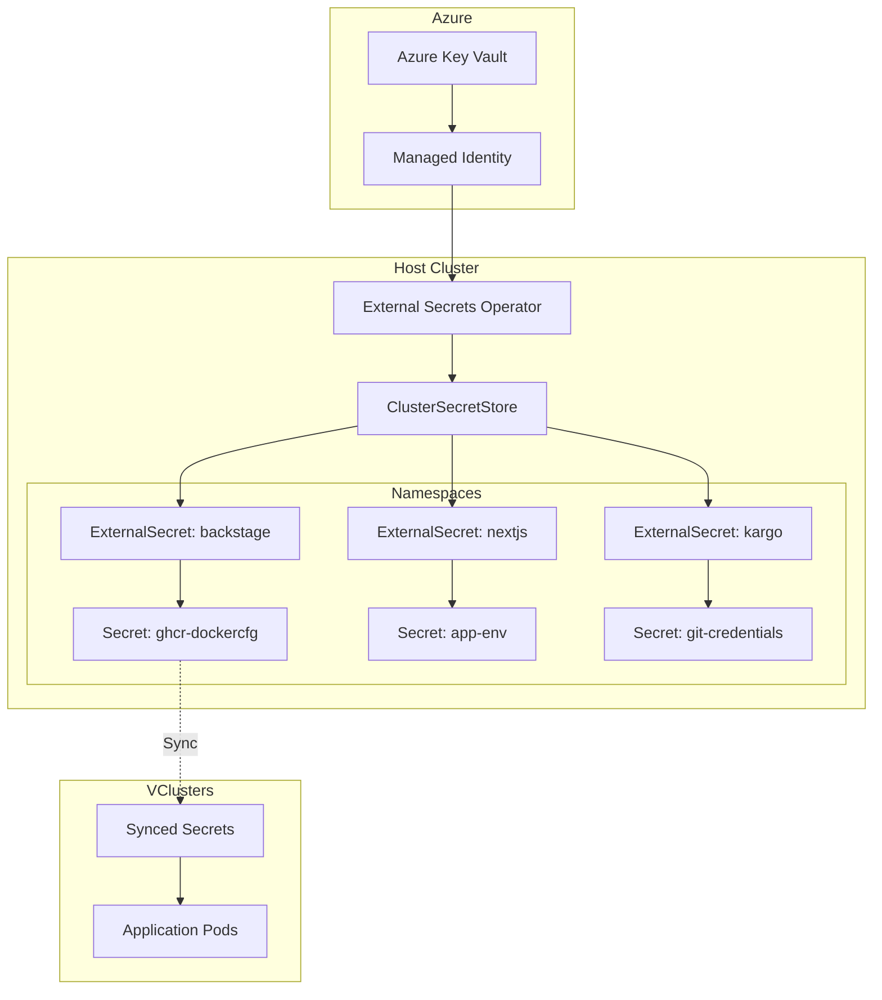

# Secrets Management

## Table of Contents
- [Overview](#overview)
- [Architecture](#architecture)
- [External Secrets Operator](#external-secrets-operator)
- [Azure Key Vault Integration](#azure-key-vault-integration)
- [Secret Types](#secret-types)
- [GHCR Authentication](#ghcr-authentication)
- [VCluster Secret Syncing](#vcluster-secret-syncing)
- [Best Practices](#best-practices)
- [Troubleshooting](#troubleshooting)

## Overview

Our secrets management architecture uses External Secrets Operator (ESO) to sync secrets from Azure Key Vault to Kubernetes. This provides:

- **Centralized Management**: Single source of truth in Azure Key Vault
- **Automatic Rotation**: Secrets refresh periodically
- **Audit Trail**: Azure logging for secret access
- **GitOps Compatible**: No secrets in Git repositories
- **Multi-Environment**: Different secrets per environment

## Architecture



## External Secrets Operator

### Installation

ESO is deployed as part of the bootstrap process:

```typescript
// Part of core platform components
{
  name: 'external-secrets',
  namespace: 'external-secrets',
  chart: {
    type: 'ExternalSecretsChart',
    props: {
      installCRDs: true
    }
  }
}
```

### ClusterSecretStore Configuration

The ClusterSecretStore provides cluster-wide access to Azure Key Vault:

```yaml
apiVersion: external-secrets.io/v1beta1
kind: ClusterSecretStore
metadata:
  name: azure-keyvault-store
spec:
  provider:
    azurekv:
      tenantId: "${AZURE_TENANT_ID}"
      vaultUrl: "https://YOUR-KEYVAULT.vault.azure.net"
      authType: WorkloadIdentity
      serviceAccountRef:
        name: external-secrets
        namespace: external-secrets
```

### Workload Identity Setup

For authentication with Azure:

```typescript
// charts/external-secrets-workload-identity-chart.ts
new k8s.KubeServiceAccount(this, 'external-secrets-sa', {
  metadata: {
    name: 'external-secrets',
    namespace: 'external-secrets',
    annotations: {
      'azure.workload.identity/client-id': process.env.AZURE_CLIENT_ID || '',
      'azure.workload.identity/tenant-id': process.env.AZURE_TENANT_ID || ''
    },
    labels: {
      'azure.workload.identity/use': 'true'
    }
  }
});
```

## Azure Key Vault Integration

### Key Vault Structure

Secrets organized by purpose:
```
KeyVault/
├── GITHUB-PAT                    # GitHub Personal Access Token
├── GITHUB-APP-PRIVATE-KEY        # GitHub App private key
├── ANTHROPIC-API-KEY            # AI services
├── OPENAI-API-KEY              
├── AZURE-OPENAI-API-KEY        
├── DATABASE-URL                 # Database connections
├── POSTGRES-PASSWORD           
├── KEYCLOAK-CLIENT-SECRET      # OAuth/OIDC
└── ARGOCD-ADMIN-PASSWORD       # Platform credentials
```

### Key Naming Convention

- Use UPPERCASE with hyphens
- Prefix with service name
- Include environment suffix if needed
- Examples:
  - `GITHUB-PAT`
  - `DATABASE-URL-STAGING`
  - `KEYCLOAK-CLIENT-SECRET-DEV`

## Secret Types

### 1. Docker Registry Credentials

For pulling private container images:

```typescript
new ExternalSecret(this, 'ghcr-dockercfg', {
  spec: {
    target: {
      name: 'ghcr-dockercfg',
      template: {
        type: 'kubernetes.io/dockerconfigjson',
        data: {
          '.dockerconfigjson': `{
            "auths": {
              "ghcr.io": {
                "username": "{{ .username }}",
                "password": "{{ .pat }}",
                "auth": "{{ printf "%s:%s" .username .pat | b64enc }}"
              }
            }
          }`
        }
      }
    },
    data: [
      {
        secretKey: 'pat',
        remoteRef: { key: 'GITHUB-PAT' }
      },
      {
        secretKey: 'username',
        remoteRef: { key: 'GITHUB-USERNAME' }
      }
    ]
  }
});
```

### 2. Environment Variables

Application configuration:

```typescript
new ExternalSecret(this, 'app-env', {
  spec: {
    target: {
      name: 'app-env',
      template: {
        data: {
          'ANTHROPIC_API_KEY': '{{ .anthropic }}',
          'OPENAI_API_KEY': '{{ .openai }}',
          'DATABASE_URL': '{{ .database }}'
        }
      }
    },
    data: [
      {
        secretKey: 'anthropic',
        remoteRef: { key: 'ANTHROPIC-API-KEY' }
      },
      {
        secretKey: 'openai',
        remoteRef: { key: 'OPENAI-API-KEY' }
      },
      {
        secretKey: 'database',
        remoteRef: { key: 'DATABASE-URL' }
      }
    ]
  }
});
```

### 3. TLS Certificates

For HTTPS/TLS:

```typescript
new ExternalSecret(this, 'tls-cert', {
  spec: {
    target: {
      name: 'tls-cert',
      template: {
        type: 'kubernetes.io/tls',
        data: {
          'tls.crt': '{{ .cert }}',
          'tls.key': '{{ .key }}'
        }
      }
    },
    data: [
      {
        secretKey: 'cert',
        remoteRef: { key: 'TLS-CERTIFICATE' }
      },
      {
        secretKey: 'key',
        remoteRef: { key: 'TLS-PRIVATE-KEY' }
      }
    ]
  }
});
```

### 4. Git Credentials

For repository access:

```typescript
new ExternalSecret(this, 'git-credentials', {
  spec: {
    target: {
      name: 'git-credentials',
      template: {
        data: {
          'username': '{{ .username }}',
          'password': '{{ .pat }}'
        }
      }
    },
    data: [
      {
        secretKey: 'username',
        remoteRef: { key: 'GIT-USERNAME' }
      },
      {
        secretKey: 'pat',
        remoteRef: { key: 'GITHUB-PAT' }
      }
    ]
  }
});
```

## GHCR Authentication

### Complete Setup for Private Images

1. **Store PAT in Azure Key Vault:**
```bash
az keyvault secret set \
  --vault-name YOUR-KEYVAULT \
  --name GITHUB-PAT \
  --value "ghp_xxxxxxxxxxxxxxxxxxxx"
```

2. **Create ExternalSecret:**
```typescript
// charts/backstage-secrets-chart.ts
new ExternalSecret(this, 'ghcr-dockercfg-external', {
  metadata: {
    name: 'ghcr-dockercfg-external',
    namespace: 'backstage',
    annotations: {
      'argocd.argoproj.io/sync-wave': '-10'  // Before deployments
    }
  },
  spec: {
    refreshInterval: '1h',
    secretStoreRef: {
      name: 'azure-keyvault-store',
      kind: ExternalSecretSpecSecretStoreRefKind.CLUSTER_SECRET_STORE
    },
    target: {
      name: 'ghcr-dockercfg',
      creationPolicy: ExternalSecretSpecTargetCreationPolicy.OWNER,
      template: {
        type: 'kubernetes.io/dockerconfigjson',
        engineVersion: ExternalSecretSpecTargetTemplateEngineVersion.V2,
        data: {
          '.dockerconfigjson': '{\n  "auths": {\n    "ghcr.io": {\n      "username": "pittampalliorg",\n      "password": "{{ .pat }}",\n      "auth": "{{ printf "%s:%s" "pittampalliorg" .pat | b64enc }}"\n    }\n  }\n}'
        }
      }
    },
    data: [{
      secretKey: 'pat',
      remoteRef: {
        key: 'GITHUB-PAT',
        conversionStrategy: ExternalSecretSpecDataRemoteRefConversionStrategy.DEFAULT
      }
    }]
  }
});
```

3. **Add to Deployment:**
```typescript
spec: {
  template: {
    spec: {
      imagePullSecrets: [
        { name: 'ghcr-dockercfg' }
      ],
      containers: [{
        image: 'ghcr.io/pittampalliorg/backstage-cnoe:latest'
      }]
    }
  }
}
```

## VCluster Secret Syncing

### Syncing from Host to VCluster

Secrets are automatically synced based on namespace patterns:

```typescript
// vcluster configuration
sync: {
  fromHost: {
    secrets: {
      enabled: true,
      mappings: {
        byName: {
          'backstage/*': 'backstage/*',   // All backstage secrets
          'nextjs/*': 'nextjs/*',         // All nextjs secrets
          'shared/*': 'config/*'          // Shared configs to different name
        }
      }
    }
  }
}
```

### Requirements for Syncing

1. **Namespace must exist on host:**
```bash
kubectl create namespace backstage
kubectl create namespace nextjs
```

2. **Secret created in host namespace:**
```yaml
apiVersion: v1
kind: Secret
metadata:
  name: ghcr-dockercfg
  namespace: backstage  # Host namespace
type: kubernetes.io/dockerconfigjson
```

3. **Automatically appears in vcluster:**
```bash
# In vcluster
kubectl --context dev-vcluster get secret -n backstage ghcr-dockercfg
```

### Synced Secret Naming

Host resources appear in vcluster namespace with modified names:
```
Original: ghcr-dockercfg (in backstage namespace)
In Host: ghcr-dockercfg-x-backstage-x-vcluster-dev-helm (in dev-vcluster namespace)
In VCluster: ghcr-dockercfg (in backstage namespace)
```

## Best Practices

### 1. Secret Rotation

Configure appropriate refresh intervals:

```typescript
spec: {
  refreshInterval: '1h',  // Check for updates hourly
  // Or for sensitive secrets:
  refreshInterval: '5m'   // More frequent updates
}
```

### 2. Secret Versioning

Track secret versions in Azure Key Vault:
```bash
# Create new version
az keyvault secret set \
  --vault-name YOUR-KEYVAULT \
  --name DATABASE-URL \
  --value "postgresql://new-connection-string"

# List versions
az keyvault secret list-versions \
  --vault-name YOUR-KEYVAULT \
  --name DATABASE-URL
```

### 3. Access Control

Limit secret access with RBAC:

```yaml
apiVersion: rbac.authorization.k8s.io/v1
kind: Role
metadata:
  name: secret-reader
  namespace: backstage
rules:
- apiGroups: [""]
  resources: ["secrets"]
  verbs: ["get", "list"]
  resourceNames: ["ghcr-dockercfg", "app-env"]
```

### 4. Secret Templates

Use templates for complex formats:

```typescript
template: {
  engineVersion: ExternalSecretSpecTargetTemplateEngineVersion.V2,
  mergePolicy: ExternalSecretSpecTargetTemplateMergePolicy.REPLACE,
  data: {
    'config.yaml': `
      database:
        host: {{ .dbHost }}
        port: {{ .dbPort }}
        password: {{ .dbPassword }}
    `
  }
}
```

### 5. Environment Separation

Use different secrets per environment:

```typescript
const secretName = envName === 'production' 
  ? 'DATABASE-URL-PROD' 
  : 'DATABASE-URL-DEV';

remoteRef: {
  key: secretName
}
```

## Troubleshooting

### Secret Not Created

Check ExternalSecret status:
```bash
kubectl get externalsecret -n backstage ghcr-dockercfg-external -o yaml
```

Look for status conditions:
```yaml
status:
  conditions:
  - type: Ready
    status: "False"
    reason: SecretSyncedError
    message: "could not get secret from provider"
```

### Authentication Issues

Verify Workload Identity:
```bash
# Check service account
kubectl get sa -n external-secrets external-secrets -o yaml

# Check federated credentials in Azure
az identity federated-credential list \
  --resource-group YOUR-RG \
  --identity-name external-secrets-identity
```

### Secret Format Issues

Validate secret content:
```bash
# Decode and check format
kubectl get secret ghcr-dockercfg -n backstage -o json | \
  jq -r '.data[".dockerconfigjson"]' | base64 -d | jq .
```

### Sync Not Working to VCluster

1. Check namespace exists on host
2. Verify vcluster sync configuration
3. Restart vcluster pod if needed:
```bash
kubectl delete pod -n dev-vcluster vcluster-dev-helm-0
```

## Security Considerations

1. **Never commit secrets to Git**
2. **Use least privilege access**
3. **Enable audit logging in Azure**
4. **Rotate secrets regularly**
5. **Use separate Key Vaults per environment**
6. **Monitor secret access patterns**
7. **Implement break-glass procedures**

## Related Documentation

- [GitOps Architecture Overview](./gitops-architecture-overview.md)
- [VCluster Architecture](./vcluster-architecture.md)
- [Troubleshooting Guide](./troubleshooting-guide.md)
- [Development Workflow](./development-workflow.md)