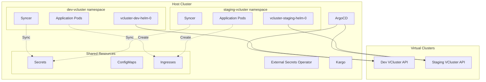
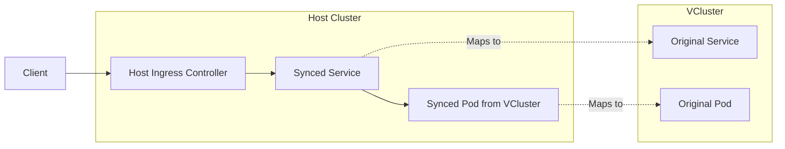

# VCluster Architecture and Configuration

## Table of Contents
- [Overview](#overview)
- [Architecture](#architecture)
- [VCluster Setup](#vcluster-setup)
- [Resource Syncing](#resource-syncing)
- [Networking and Ingress](#networking-and-ingress)
- [Multi-Environment Strategy](#multi-environment-strategy)
- [Application Deployment](#application-deployment)
- [Troubleshooting](#troubleshooting)

## Overview

We use VClusters to provide isolated Kubernetes environments for different stages (dev, staging) while maintaining a single host cluster. This provides:

- **Resource Isolation**: Complete namespace and RBAC isolation
- **Cost Efficiency**: Share underlying infrastructure
- **Easy Cleanup**: Delete entire vcluster to clean environment
- **Independent Scaling**: Each vcluster can scale independently
- **Security Boundaries**: Network policies and resource quotas per vcluster

## Architecture



## VCluster Setup

### Installation via ArgoCD

VClusters are deployed as ArgoCD Applications using the Loft vcluster Helm chart:

```typescript
// charts/apps/vcluster-dev-chart.ts
new Application(this, 'vcluster-dev-helm', {
  metadata: {
    name: 'vcluster-dev-helm',
    namespace: 'argocd',
    annotations: {
      'argocd.argoproj.io/sync-wave': '10'  // Deploy early
    }
  },
  spec: {
    source: {
      repoUrl: 'https://charts.loft.sh',
      chart: 'vcluster',
      targetRevision: '0.26.0',
      helm: {
        valuesObject: helmValues
      }
    },
    destination: {
      server: 'https://kubernetes.default.svc',
      namespace: 'dev-vcluster'
    }
  }
});
```

### VCluster Configuration

Key configuration in Helm values:

```typescript
const helmValues = {
  sync: {
    fromHost: {
      nodes: { enabled: true },           // Share node information
      ingressClasses: { enabled: true },  // Use host's ingress controller
      secrets: {
        enabled: true,
        mappings: {
          byName: {
            'nextjs/*': 'nextjs/*',        // Sync all nextjs secrets
            'backstage/*': 'backstage/*',  // Sync all backstage secrets
          }
        }
      }
    },
    toHost: {
      serviceAccounts: { enabled: true }, // For Azure Workload Identity
      ingresses: { enabled: true },       // Expose services via host ingress
    }
  },
  controlPlane: {
    advanced: { virtualScheduler: { enabled: true } },
    proxy: {
      extraSANs: [
        'vcluster-dev-helm.dev-vcluster.svc',
        'dev-vcluster.cnoe.localtest.me',
      ]
    }
  }
};
```

## Resource Syncing

### Host to VCluster Syncing

Resources are synced FROM the host cluster TO vclusters:

#### 1. Secrets Syncing

Secrets created in host namespaces are automatically synced to vclusters:

```yaml
# Host cluster
namespace: backstage
secret: ghcr-dockercfg

# Synced to vcluster as
namespace: backstage (in vcluster)
secret: ghcr-dockercfg
```

**Implementation:**
```typescript
sync: {
  fromHost: {
    secrets: {
      enabled: true,
      mappings: {
        byName: {
          'backstage/*': 'backstage/*',  // Sync pattern
        }
      }
    }
  }
}
```

**Important**: The namespace must exist on the host cluster for syncing to work.

#### 2. ConfigMaps Syncing

Similar to secrets, ConfigMaps can be synced:

```typescript
sync: {
  fromHost: {
    configMaps: {
      enabled: true,
      mappings: {
        byName: {
          'shared-config/*': 'config/*'
        }
      }
    }
  }
}
```

### VCluster to Host Syncing

Resources created in vclusters can be synced TO the host:

#### 1. Ingress Syncing

Ingresses created in vclusters are synced to the host for external access:

```yaml
# Created in vcluster
apiVersion: networking.k8s.io/v1
kind: Ingress
metadata:
  name: backstage-ingress-staging
  namespace: backstage

# Appears on host as
metadata:
  name: backstage-ingress-staging-x-backstage-x-vcluster-staging-helm
  namespace: staging-vcluster
```

#### 2. ServiceAccount Syncing

For Azure Workload Identity:

```typescript
sync: {
  toHost: {
    serviceAccounts: { enabled: true }
  }
}
```

### Naming Convention

Synced resources follow a naming pattern:
```
<resource-name>-x-<namespace>-x-<vcluster-name>
```

Example:
- Original: `backstage-staging` pod in `backstage` namespace
- Synced: `backstage-staging-x-backstage-x-vcluster-staging-helm`

## Networking and Ingress

### Ingress Architecture



### TLS Passthrough Configuration

For vcluster API access, TLS passthrough is required:

```yaml
# Ingress for vcluster API
apiVersion: networking.k8s.io/v1
kind: Ingress
metadata:
  name: staging-vcluster-ingress
  annotations:
    nginx.ingress.kubernetes.io/backend-protocol: HTTPS
    nginx.ingress.kubernetes.io/ssl-passthrough: "true"
    nginx.ingress.kubernetes.io/ssl-redirect: "false"
spec:
  ingressClassName: nginx
  rules:
  - host: staging-vcluster.cnoe.localtest.me
    http:
      paths:
      - path: /
        pathType: Prefix
        backend:
          service:
            name: vcluster-staging-helm
            port:
              number: 443
```

### Application Ingress

Applications in vclusters create ingresses that are synced to host:

```yaml
# In vcluster
apiVersion: networking.k8s.io/v1
kind: Ingress
metadata:
  name: backstage-ingress-staging
  namespace: backstage
spec:
  rules:
  - host: backstage-staging.cnoe.localtest.me
    http:
      paths:
      - path: /
        backend:
          service:
            name: backstage-staging
            port:
              number: 7007
```

## Multi-Environment Strategy

### Environment Isolation

Each environment gets its own vcluster:

```
Host Cluster
├── dev-vcluster namespace
│   └── vcluster-dev-helm (vcluster pod)
│       └── Virtual cluster with dev workloads
└── staging-vcluster namespace
    └── vcluster-staging-helm (vcluster pod)
        └── Virtual cluster with staging workloads
```

### Resource Allocation

Different resource limits per environment:

```typescript
// Dev environment - smaller resources
const devResources = {
  limits: { cpu: '2', memory: '4Gi' },
  requests: { cpu: '1', memory: '2Gi' }
};

// Staging environment - production-like resources
const stagingResources = {
  limits: { cpu: '4', memory: '8Gi' },
  requests: { cpu: '2', memory: '4Gi' }
};
```

### Namespace Strategy

Consistent namespace names across vclusters:
- `backstage` namespace exists in both dev and staging vclusters
- `nextjs` namespace exists in both dev and staging vclusters
- Applications differentiated by deployment names: `backstage-dev` vs `backstage-staging`

## Application Deployment

### ArgoCD Integration

ArgoCD on the host cluster deploys to vclusters:

```typescript
// Application targeting dev vcluster
new Application(this, 'app-dev', {
  spec: {
    destination: {
      name: 'dev-vcluster',      // Registered cluster name
      namespace: 'backstage'      // Namespace in vcluster
    },
    source: {
      repoUrl: 'cnoe://backstage-dev/manifests',
      path: '.'
    }
  }
});
```

### Cluster Registration

VClusters are automatically registered with ArgoCD via External Secrets:

```typescript
// charts/vcluster-registration-job-chart.ts
// Job that extracts vcluster credentials and creates ArgoCD cluster secret

new Job(this, 'vcluster-registration', {
  spec: {
    template: {
      spec: {
        containers: [{
          name: 'register',
          image: 'bitnami/kubectl:latest',
          command: ['bash'],
          args: ['-c', registrationScript]
        }]
      }
    }
  }
});
```

### Registration Process

1. **VCluster Creation**: Helm creates vcluster with certificates
2. **Secret Extraction**: Job extracts kubeconfig from vcluster secret
3. **ArgoCD Secret**: Creates cluster secret in ArgoCD namespace
4. **Cluster Available**: ArgoCD can now deploy to vcluster

## Application Patterns

### Pattern 1: Environment-Specific Applications

Separate applications per environment:

```typescript
// backstage-dev uses sleep infinity for development
new BackstageParameterizedChart(app, 'backstage-dev', {
  environmentName: 'dev',
  command: ['sleep', 'infinity']  // Keep container alive for development
});

// backstage-staging runs actual application
new BackstageParameterizedChart(app, 'backstage-staging', {
  environmentName: 'staging'
  // Normal startup command
});
```

### Pattern 2: Shared Configuration

Shared secrets/configs synced to all environments:

```typescript
// Create in host cluster
new ExternalSecret(this, 'shared-config', {
  metadata: {
    name: 'app-config',
    namespace: 'shared'  // Host namespace
  }
});

// Synced to vclusters via mapping
'shared/*': 'config/*'  // Available in all vclusters
```

## Troubleshooting

### Common Issues

#### 1. Pods Not Scheduled

**Symptom**: Pods in vcluster showing as Pending

**Cause**: Virtual scheduler not enabled or node sync issues

**Solution**:
```typescript
controlPlane: {
  advanced: {
    virtualScheduler: { enabled: true }
  }
}
```

#### 2. Ingress Not Accessible

**Symptom**: 404 or connection refused to application

**Cause**: Ingress not synced to host

**Solution**:
```typescript
sync: {
  toHost: {
    ingresses: { enabled: true }
  }
}
```

#### 3. Secrets Not Available

**Symptom**: Pods failing with secret not found

**Cause**: Namespace doesn't exist on host or sync not configured

**Solution**:
1. Create namespace on host: `kubectl create namespace backstage`
2. Verify sync configuration includes namespace pattern
3. Check secret exists on host

#### 4. Cannot Connect to VCluster API

**Symptom**: kubectl context fails to connect

**Cause**: TLS passthrough not enabled or DNS issues

**Solution**:
1. Enable SSL passthrough in nginx:
   ```yaml
   controller:
     extraArgs:
       enable-ssl-passthrough: true
   ```
2. Add to `/etc/hosts`:
   ```
   127.0.0.1 dev-vcluster.cnoe.localtest.me
   127.0.0.1 staging-vcluster.cnoe.localtest.me
   ```

### Debugging Commands

```bash
# List all vclusters
kubectl get pods -A | grep vcluster

# Check vcluster logs
kubectl logs -n dev-vcluster vcluster-dev-helm-0

# List synced resources
kubectl get pods -n dev-vcluster --show-labels

# Check ingress sync
kubectl get ingress -A | grep vcluster

# Verify cluster registration
kubectl get secret -n argocd -l argocd.argoproj.io/secret-type=cluster

# Connect to vcluster directly
vcluster connect vcluster-dev-helm -n dev-vcluster
```

## Best Practices

1. **Resource Limits**: Set appropriate limits for vcluster pods
2. **Namespace Consistency**: Use same namespace names across vclusters
3. **Sync Configuration**: Only sync necessary resources
4. **Monitoring**: Set up monitoring for vcluster health
5. **Backup**: Regular backups of vcluster state
6. **Security**: Use network policies to isolate vclusters
7. **Cleanup**: Delete unused vclusters to save resources

## Related Documentation

- [GitOps Architecture Overview](./gitops-architecture-overview.md)
- [Secrets Management](./secrets-management.md)
- [Troubleshooting Guide](./troubleshooting-guide.md)